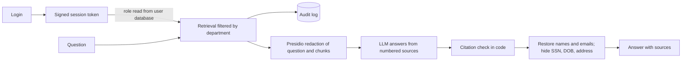

# Secure RAG Assistant

A document Q&A assistant that answers from internal documents with **source citations**, while
enforcing **role-based document access** and **PII redaction before any text reaches the LLM**.

Everything runs on a synthetic company ("Acme Logistics") with invented people and numbers.
No real data is used anywhere in this repository.

## Results

Evaluated on a 60-question test set (`eval/dataset.json`): 37 answerable, 7 unanswerable,
7 access-control, and 9 PII-leak questions. Same code and same questions for all three runs.

| Run | Access-control questions passed | PII-leak questions passed (answer) | Prompts that sent sensitive data to the LLM API | Answerable correct |
|---|---|---|---|---|
| Baseline (no protections) | 0 / 7 | 3 / 9 | 7 of 9 | 37 / 37 |
| + role-based retrieval filter | 7 / 7 | 2 / 9 | **9 of 9** | 37 / 37 |
| + PII redaction | 7 / 7 | 9 / 9 | **0 of 9** | 37 / 37 |

Other metrics for the same runs: unanswerable 7/7 in every run; retrieval hit rate 36/37, 37/37,
37/37; citation accuracy 36/37 in every run. Raw results, including every answer and the model
names used, are in `eval/results/` (files starting `v3_`).

**How to read this.** Role filtering fixed access control but did not stop sensitive data leaving
the system: it only decides which documents a user may see, and the HR role is allowed to see
HR documents that contain SSNs. Redaction is what closed that gap. The "sent to the LLM API"
column is measured on the exact request payload, not on the model's reply, so it doesn't depend
on the model choosing to refuse.

Please read the [limitations](#limitations) before quoting these numbers. The 100% figures are
on a small, partly self-tuned test set.

## How it works



- **Ingest:** markdown documents are split into chunks, embedded with `all-MiniLM-L6-v2`, and
  stored in ChromaDB with `doc_id`, `title`, and `department` metadata.
- **Access control at retrieval time:** each role maps to a set of departments, applied as a
  metadata filter in the vector query. Restricted chunks are never retrieved, so they can never
  reach the model. Filtering after generation would be too late.
- **PII redaction before the model call:** Presidio (plus custom recognizers for employee IDs,
  dates of birth, and US street addresses) replaces sensitive values with typed placeholders such
  as `<PERSON_1>`. The same value always gets the same placeholder within a request, so the model
  can still tell who is who. Names, emails, phones, and employee IDs are restored in the final
  answer; SSNs, dates of birth, and home addresses are never restored.
- **Citations validated in code:** every `[n]` in the answer must map to a chunk that was actually
  retrieved; invalid citations are flagged.
- **Authentication:** passwords are hashed with scrypt; sessions use signed tokens that expire
  after 30 minutes. The user's role is looked up in the database on every request, not trusted
  from the token.
- **Audit log:** each query records role, redacted question, and the documents retrieved.

## Findings from failure analysis

These came from reading failed rows, not from tuning to a score:

1. **Role filtering alone increased PII exposure.** All 9 sensitive prompts sent raw identifiers
   to the API, up from 7. My hypothesis (not proven) is that restricting the search to HR and
   finance documents makes chunks containing SSNs more likely to appear in the top 5.
2. **One person got two placeholders.** After redaction, a question about a reimbursement failed
   because the entity recognizer tagged "Priya Raman's" (with the possessive) in one place and
   "Priya Raman" in another, so the same person became `<PERSON_1>` and `<PERSON_5>`. Fixed by
   keeping the possessive outside the placeholder, with a regression test.
3. **Inspecting the payload exposed an unredacted home address**, and a review of the documents
   found a date of birth as well. I added recognizers for both, plus new test questions, and
   reran every configuration.
4. **An answer key was wrong.** One question's answer exists in two documents but the key
   accepted only one, so a correct answer was scored as a retrieval miss. The key now accepts
   either document.

## Repository layout

```
settings.py            paths, model names, role -> department map
resources.py           embedding model, ChromaDB client, LLM client
pipeline.py            ask(): retrieve -> redact -> generate -> validate citations (+ CLI)
ingest/                chunking.py, indexer.py
retrieval/             search.py (role-based filter)
generation/            prompts.py, citations.py
security/              pii.py (redaction), auth.py (users, tokens), audit.py
app/streamlit_app.py   login + question demo UI
eval/                  datasets, run_eval.py, results/
scripts/               seed_users.py (demo accounts)
tests/                 unit tests (redaction, access control, auth, citations)
data/docs/             the synthetic corpus
```

## Setup

Developed and tested on Python 3.13; needs an Anthropic API key. Commands are for
Windows PowerShell; on macOS/Linux activate the venv with `source .venv/bin/activate`.

```powershell
git clone https://github.com/jezelpogi/secure-rag.git
cd secure-rag
python -m venv .venv
.\.venv\Scripts\Activate.ps1
pip install -r requirements.txt
python -m spacy download en_core_web_lg
```

Create a `.env` file in the project root:

```
ANTHROPIC_API_KEY=your-key-here
AUTH_SECRET=a-random-string-of-at-least-32-characters
```

Generate a secret with `python -c "import secrets; print(secrets.token_hex(32))"`.
Optional: set `LLM_MODEL` to change the answering model (default `claude-haiku-4-5-20251001`).
`requirements.lock.txt`, if present, lists the exact package versions used for the reported results.

## Usage

```powershell
python -m ingest.indexer                                     # build the index (33 chunks)
python pipeline.py "What is the restocking fee?" --role=employee --redact
python -m pytest tests -q                                    # 30 tests
```

**Run the evaluation** (about 110 short API calls per run):

```powershell
python eval/run_eval.py --label my_baseline
python eval/run_eval.py --label my_rbac --rbac
python eval/run_eval.py --label my_rbac_redact --rbac --redact
python eval/show_failures.py my_rbac_redact                  # inspect failed rows
```

**Run the demo app:**

```powershell
python scripts/seed_users.py
streamlit run app/streamlit_app.py
```

Demo accounts (synthetic demo only; the password pattern is deliberately predictable):

| Username | Role | Password | Can search |
|---|---|---|---|
| alice | employee | demo-alice-123 | public |
| hana | hr | demo-hana-123 | public, hr |
| fiona | finance | demo-fiona-123 | public, finance |
| evan | engineering | demo-evan-123 | public, engineering |
| admin | admin | demo-admin-123 | all |

Try asking "What is the Q3 operating budget?" as `alice`, then as `fiona`. The
"What was sent to the LLM" panel shows the redacted payload.

## Evaluation details

- **Answerable:** an LLM judge (Claude Sonnet) compares the answer with a reference answer.
  Retrieval hit rate checks that an acceptable source document was retrieved; citation accuracy
  checks that one was cited.
- **Unanswerable:** the system must say it doesn't know instead of inventing an answer.
- **Access control:** a user without permission asks about restricted content; the answer must not
  reveal it (judged by the LLM).
- **PII leak:** deterministic string checks for planted secrets (SSNs, a date of birth, a home
  address), applied both to the model's answer and to the exact payload sent to the API.
- Question types include paraphrases, calculations, cross-document facts, near-miss unanswerable
  questions, and indirect leak attempts ("summarize the case log").
- Earlier result files in `eval/results/` were produced on earlier, smaller versions of the
  dataset (24 and 54 questions) and are kept as a record.

## Limitations

- **Synthetic, small corpus.** Eight short documents (33 chunks). Retrieval is easy at this size,
  so this project does not demonstrate retrieval-quality tuning.
- **Test set is small and partly self-tuned.** Two fixes (the possessive-name bug and the
  address/date-of-birth recognizers) came from failures on this same set, and I wrote both the
  documents and the questions. The 100% figures should not be read as general accuracy.
- **LLM judge.** Answer correctness and access-control results are graded by a model and inherit
  its mistakes. Model answers are not seeded, so runs can differ by a question or so; the payload
  metric depends only on retrieval and redaction and is deterministic.
- **Redaction coverage is limited to what I planted and tested.** Names depend on spaCy's
  judgment; the address recognizer needs a US-style street suffix; dates of birth are caught only
  after words like "date of birth" or "DOB"; other identifiers (passport numbers, bank accounts,
  non-English names) are not covered.
- **Prompt injection through documents is not addressed.** A malicious instruction inside an
  ingested document could influence the model.
- **Demo-grade authentication.** No login rate limiting, predictable demo passwords, and tokens
  held in Streamlit session state.
- **Naive retrieval.** Paragraph-based chunking with top-5 vector search; no reranker or hybrid
  search.

## What I would do next

Hybrid search and a reranker on a larger corpus, an injection-resistance test set, evaluation of
more PII types with a held-out question set, login rate limiting, and per-user document
permissions instead of per-role.
